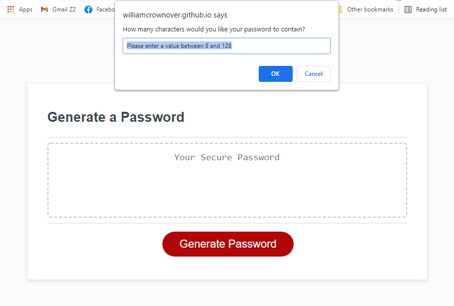
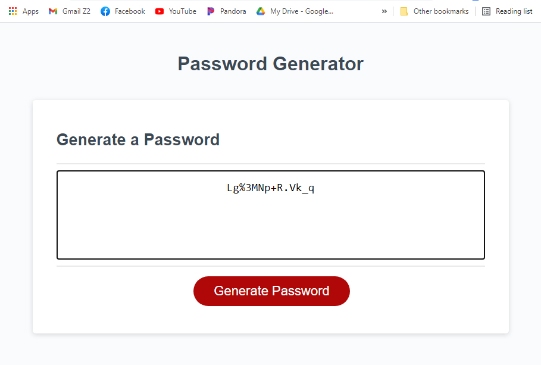

# Customizable Password Generator

[](https://opensource.org/licenses/MIT)

## Description
This project is a random password generator that takes user inputs for how long they would like their password to be and what types of characters should be used to make the password. The purpose of this project is to help quickly respond to security requests for stronger password protection. This could be used in a multitude of fields that work with sensitive data. The generator itself includes guarantee checks to make sure the randomized string of characters contains the requested character sets and delivers them using an intuitive user interface.

This generator supports the following criteria
- Can generate a password of length 8 to 128 character long
- Must include one of the following characters sets or any combination of them
    - Special Characters
    - Numeric Characters
    - Lowercase Characters
    - Uppercase Characters

## User Story
```
AS AN employee with access to sensitive data
I WANT to randomly generate a password that meets certain criteria
SO THAT I can create a strong password that provides greater security
```

## Live Site
https://williamcrownover.github.io/customizable-password-generator/

<strong>Asking for password length</strong>

<strong>A generated password</strong>


## Initial Pseudocode/User experience
I created this outline of pseudocode as a foundation to guide my thought process as I worked through developing the JavaScript file. Some aspects of this pseudocode were not needed or altered as I ran tests in the development process.
- Character data needed to generate a password can be stored in `allCharacterSets[]` which includes `specialCharacters`, `numericCharacters`, `lowercaseCharacters`, `uppercaseCharacters`
- The user clicks the `generateBtn` to `writePassword()` to the text box
    - The program creates a `password` by using `generatePassword()` process
        - First `askPasswordLength()` runs to store `passwordLength` for later use
            - An alert asks for “How many characters would you like your password to contain?”
            - The user enters a `passwordLength` value
                - The `passwordLength` is `checkLength()` to be sure it’s value is 8 or more and equal to or less than 128
                    - If `passwordLength` doesn’t meet this criteria an alert is presented to the user saying “Password length must be between 8 and 128 characters.”
                        - The user starts the process again
                    - Otherwise the value is acceptable and returned in `passwordLength`
        - Second `chooseCharacterSets()` runs 4 times for each of the `characterSetNames[]`, “special”, “numeric”, “lowercase”, “uppercase”
            - An alert asks “Click OK to confirm including `characterSetNames[i]` characters.” 
            - The user may click “OK” or “cancel”
                - Choosing “OK” `combineRequestedCharacterSet()` appends `allCharacterSets[i] to the end of `combinedCharacters`
                    - `userSetChoices[i]` is stored as 1
                - Choosing “cancel” stores `userSetChoices[i]` as 0
                - On the 4th set `checkCombinedCharacters()` evaluates if any sets were selected
                    - If `combinedCharacters` contains no info an alert is presented saying  “Please include at least one set of characters to use.”
                        - The user starts the process again
                    - Otherwise `combinedCharacters` is returned
        - Third `assignRandomCharacters()` to `password` for as many characters were requested in `passwordLength`
            - A random character from `combinedCharacters` is appended to the end of `password`
            - Once the `passwordLength` value has been reached, return the `password`
        - If `sumOfSetChoices` in `userSetChoices[]` is 1
            - Return the `password` to be presented to the user
        - If `sumOfSetChoices` in `userSetChoices[]` is greater than 1, `guaranteePasswordContainsSets()` from corresponding `allCharacterSets[]`
            - Divide `passwordLength` by `sumOfSetChoices` into `passwordChunk`
            - For each `userSetChoices[]` value `replaceCharacter()`
                - If `userSetChoices[i]` is 1
                    - Randomly replace a character with allCharacterSets[i] contained within range of `passwordChunk` multiplied by i plus `passwordChunk`
                - Return the `password` to be presented to the user
        - The `password` is displayed in the text box on the website

## License
Licensed under the MIT License  - https://opensource.org/licenses/MIT

## Contact

If you have any questions you can email me at williamcrownover1@gmail.com.


You can also check out my other work on GitHub at [WilliamCrownover](https://github.com/WilliamCrownover)
